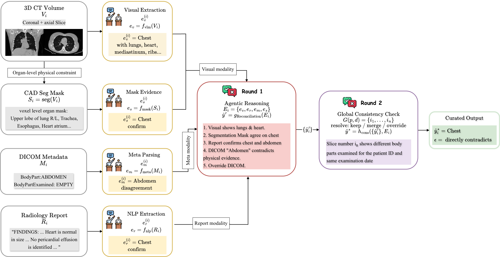

## Vision-Language Model Guided Semantic Curation for Large-Scale medical data cohorts

An agentic reconciliation framework that integrate anatomical evidence from images, segmentation masks, metadata, and reports, resolve cross-modal conflicts, and infer globally coherent anatomical region assignments without human supervision. 


🏗 **Pipeline Overview**




## 📂 Repository Structure

## 📊 Evaluation

## 🔒 Data Availability and Reproducibility

The clinical dataset used for probe training and evaluation contains protected health information and cannot be publicly released.
The embeddings used to train this probe were extracted using a pretrained visual encoder developed in a separate ongoing research project that is currently under peer review and therefore cannot be publicly released at this stage.

```bash
python -m mlp \
  --mode train \
  --round3 \
  --embedding_index_parquet \
  --out_dir \
  --hidden_sizes 512,256 \
  --max_iter 200 \
  --patience 30 \
  --seed 42 \
  --eval_threshold 0.5 \
  --weight_decay 5e-3 \
  --pos_weight_power 0.15
```
```bash
python -m mlp \
  --mode predict \
  --model outputs/probe_train/model.joblib \
  --embedding_index_parquet \
  --out_dir outputs/probe_predict \
  --exclude_manifest_csv \
  --eval_jsonl
```
```bash
python -m expert \
  --manual_csv \
  --pred_csv outputs/probe_predict/predictions.csv \
  --dkfz_bpreg /path/to/bpreg_results.jsonl \
  --report_meta_match \
  --outdir outputs/expert_eval \
  --bootstrap 1000 \
  --bootstrap_seed 42
```
  
